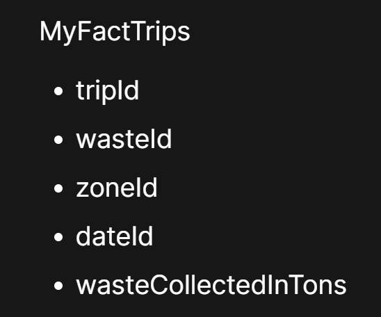
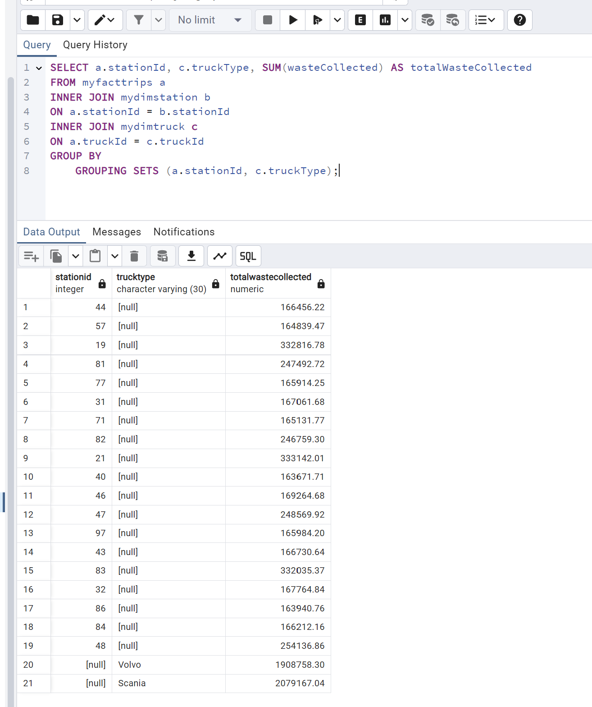
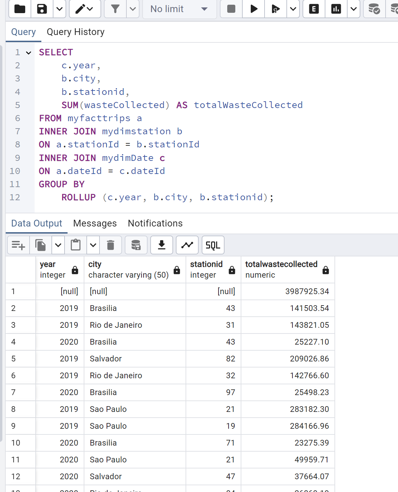
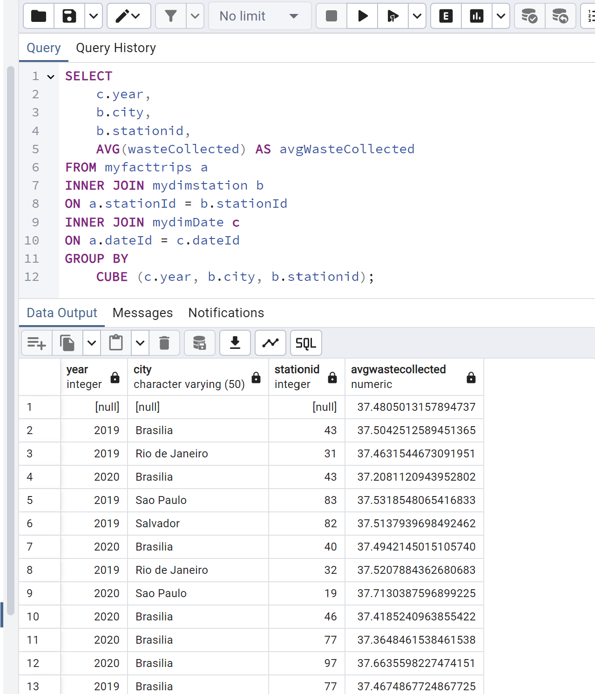

# Task1


# Task2


# Task3


# Task4



# Task5 - MyDimDate Table Creation

```sql
CREATE TABLE MyDimDate (
    dateid INT PRIMARY KEY,
    date DATE,
    Year INT,
    Quarter INT,
    QuarterName VARCHAR(5),
    Month INT,
    Monthname VARCHAR(15),
    Day INT,
    Weekday INT,
    WeekdayName VARCHAR(15)
)
```

# Task6 - MyDimWaste Table Creation

```sql
CREATE TABLE MyDimWaste (
    wasteId INT PRIMARY KEY,
    wasteType VARCHAR(50)
)
```

# Task7 - MyDimZone Table Creation

```sql
CREATE TABLE MyDimZone (
    zoneId INT PRIMARY KEY,
    collectionZone VARCHAR(50),
    city VARCHAR(50)
)
```

# Task8 - MyFactTrips Table Creation

```sql
CREATE TABLE MyFactTrips (
    tripId BIGINT PRIMARY KEY,
    wasteId INT,
    dateId INT,
    zoneId INT,
    wasteCollected DECIMAL(10,2),

    FOREIGN KEY (dateId) REFERENCES MyDimDate(dateId),
    FOREIGN KEY (wasteId) REFERENCES MyDimWaste(wasteId),
    FOREIGN KEY (zoneId) REFERENCES MyDimZone(zoneId)

)
```

# Task DimTruck

```sql
CREATE TABLE MyDimTruck(
    truckId INT PRIMARY KEY,
    truckType VARCHAR(30)
)
```

# Task DimStation

```sql
CREATE TABLE MyDimStation(
    stationId INT PRIMARY KEY,
    city VARCHAR(50)
)
```

```sql
CREATE TABLE MyFactTrips(
    tripId BIGINT PRIMARY KEY,
    dateId INT,
    stationId INT,
    truckId INT,
    wasteCollected DECIMAL(10,2),

    FOREIGN KEY (dateId) REFERENCES MyDimDate(dateId),
    FOREIGN KEY (stationId) REFERENCES MyDimStation(stationId),
    FOREIGN KEY (truckId) REFERENCES MyDimTruck(truckId)
)
```

# Task 13 GROUPING SETS

```sql
SELECT
    a.stationId,
    c.truckType,
    SUM(wasteCollected) AS totalWasteCollected
FROM myfacttrips a
INNER JOIN mydimstation b
ON a.stationId = b.stationId
INNER JOIN mydimtruck c
ON a.truckId = c.truckId
GROUP BY
	GROUPING SETS (a.stationId, c.truckType);
```



# Task 14 ROLLUP

```sql
SELECT
	c.year,
	b.city,
	b.stationid,
	SUM(wasteCollected) AS totalWasteCollected
FROM myfacttrips a
INNER JOIN mydimstation b
ON a.stationId = b.stationId
INNER JOIN mydimDate c
ON a.dateId = c.dateId
GROUP BY
	ROLLUP (c.year, b.city, b.stationid);
```



# Task 15 CUBE

```sql
SELECT
	c.year,
	b.city,
	b.stationid,
	AVG(wasteCollected) AS avgWasteCollected
FROM myfacttrips a
INNER JOIN mydimstation b
ON a.stationId = b.stationId
INNER JOIN mydimDate c
ON a.dateId = c.dateId
GROUP BY
	CUBE (c.year, b.city, b.stationid);
```



# Task 16 Materialized View

```sql
CREATE MATERIALIZED VIEW max_waste_stats (city, stationId, truckType, maxWasteCollected) AS
(
	SELECT
		b.city,
		b.stationid,
		c.truckType,
		MAX(wasteCollected) AS maxWasteCollected
	FROM myfacttrips a
	INNER JOIN mydimstation b
	ON a.stationId = b.stationId
	INNER JOIN mydimtruck c
	ON a.truckId = c.truckId
	GROUP BY b.city, b.stationid, c.truckType
);

REFRESH MATERIALIZED VIEW max_waste_stats;

SELECT * FROM max_waste_stats;
```
